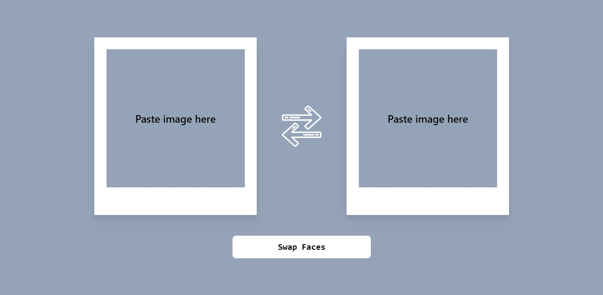
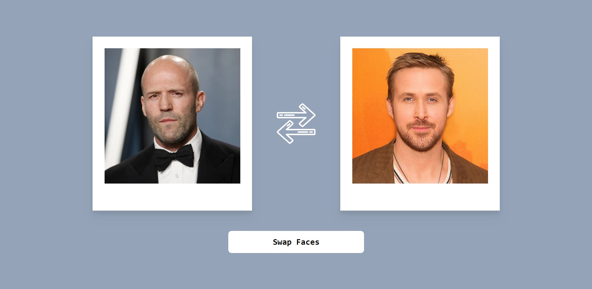
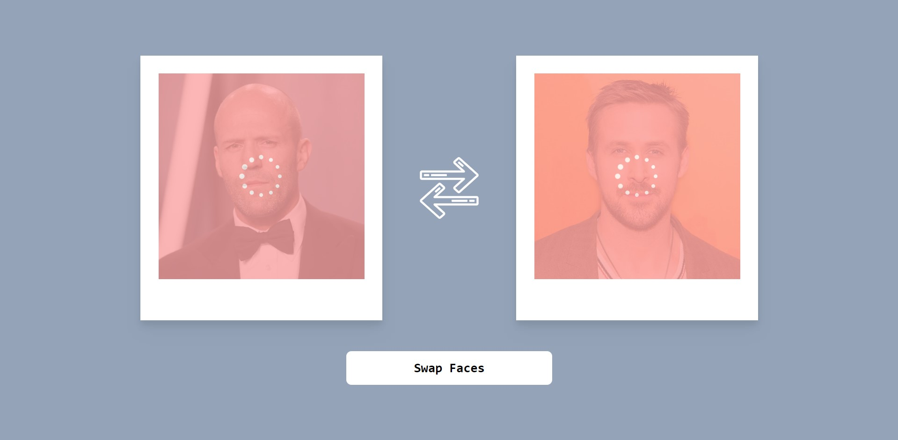
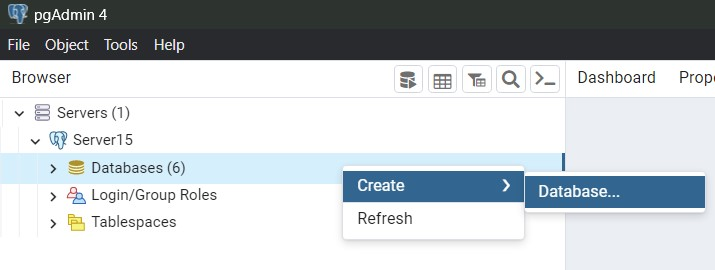

# Face Swap

<p align="center"></p>
<p align="center"></p>
<p align="center"></p>
<p align="center"></p>

---

### Table of Contents

- [Description](#description)
- [Installation](#installation)
- [How To Launch In Browser](#how-to-launch-in-browser)
- [References](#references)
- [Author Info](#author-info)

---

## Description

This is a one page web service for swapping faces between two photos. The main goal of the project was to gain skills in connecting third-party scripts inside NestJS. Specifically, in this case, a third-party Python script was connected. (Thanks to [etosworld](https://github.com/etosworld) for such a great open source script --> [etos-faceswap](https://github.com/etosworld/etos-faceswap.git))

#### Technologies

- TypeScript
- React.js
- Sass
- Tailwind CSS
- NestJS
- Python
- OpenCV
- Dlib

[Back To The Top](#face-swap)

---

## Installation

### Client

#### Requirements

- Node.js
- npm

#### Modules

All you need to get started is to install node_modules for client side. Go inside "face-swap-client" directory and open Command Prompt. Type this to install modules:

```console
npm install
```

---

### Server

#### Requirements

- Node.js
- npm
- PostgreSQL
- pgAdmin

#### Modules

Just like with the client side, you first need to install the modules. Go inside "face-swap-server" directory and open Command Prompt. Type this to install modules:

```console
npm install
```

#### Database

To access a database, you must first create it. You can easily do this using PgAdmin:

<p align="center"></p>

> This is pgAdmin 4 v6.19.

After creating the database, you need to enter your credentials in the environment variables. Open ".development.env" file and edit credentials here. For example:

```console
PORT=5000
POSTGRES_HOST=localhost
POSTGRES_PORT=5432
POSTGRES_USERNAME=postgres
POSTGRES_PASSWORD=root
POSTGRES_DB=face_swap
```

> All fields except PORT are required.

---

### Python script

#### Requirements

- Python 3+
- pip
- Dlib

> I used Dlib v19.22.99 with Python v3.9.

#### Modules

Go inside "face-swap-py" directory and open Command Prompt. Type this to install dependencies listed in requirements.txt:

```console
pip install -r requirements.txt
```

You can learn more about installing dependencies for this script at [etos-faceswap](https://github.com/etosworld/etos-faceswap.git).

[Back To The Top](#face-swap)

---

## How To Launch In Browser

To run the project in a browser, you will need two terminals. Open first command prompt in the "face-swap-client" directory. Run the following command:

```console
npm start
```

To start the server, open a command prompt in the "face-swap-server" directory and run the following command:

```console
npm run start:dev
```

---

## References

### [Face Swap script on Phyton](https://github.com/etosworld/etos-faceswap.git)

### [React](https://react.dev/)

### [Nest](https://nestjs.com/)

### [Python](https://www.python.org/)

### [pgAdmin](https://www.pgadmin.org/)

[Back To The Top](#face-swap)

---

## Author Info

LinkedIn - [Viacheslav Matvieiev](linkedin.com/in/viacheslav-matvieiev-87a554272)

[Back To The Top](#face-swap)
